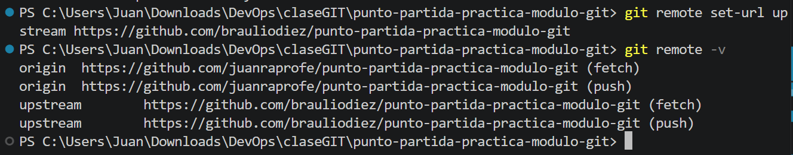
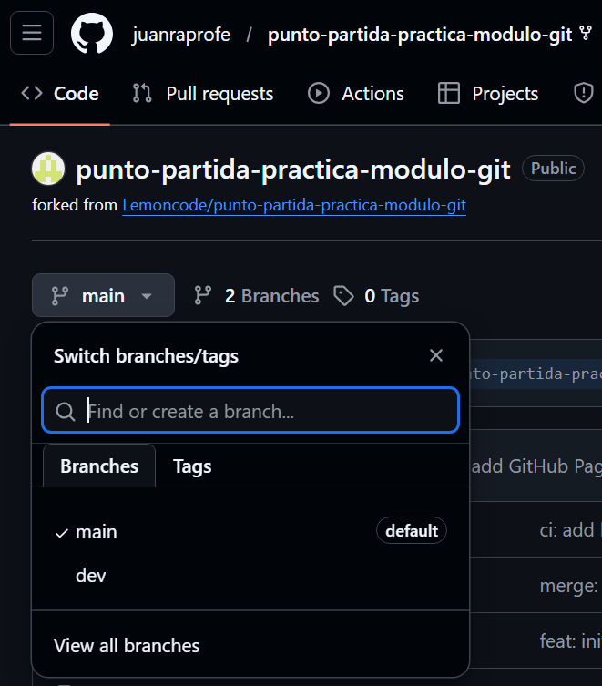
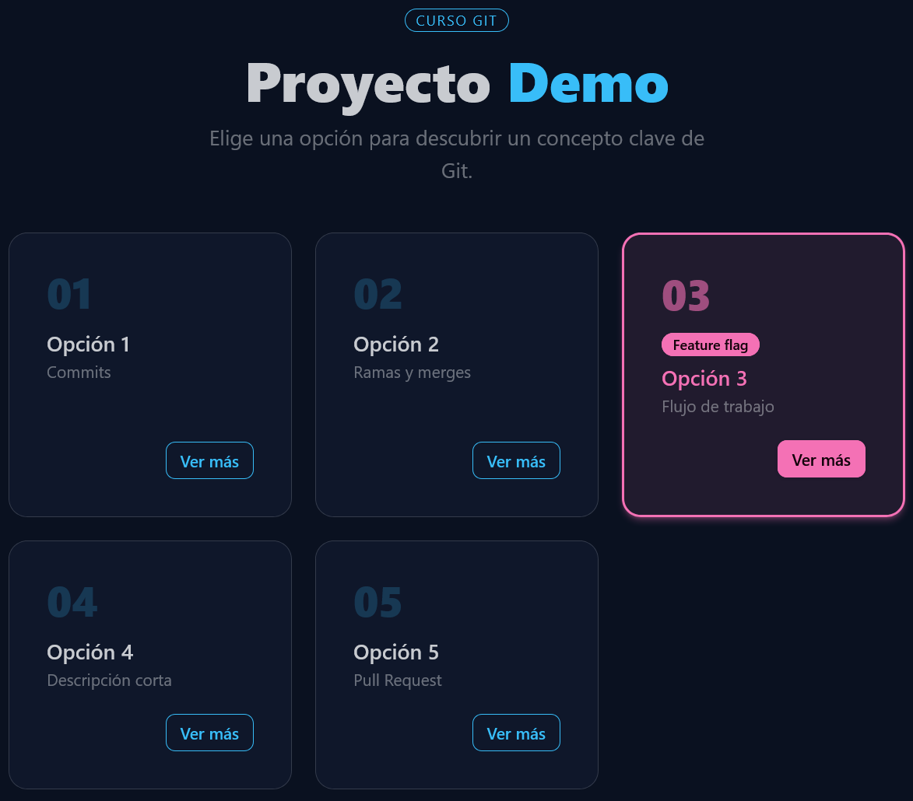

# DIARIO — Actividad : Laboratorio Git

Diario del desarrollo de la actividad Laboratorio Git

<!-- plantilla inserción imagen -->
<!--  -->
##  TASK 1 --> Fork y configuración inicial
### Fork
Un fork es una copia completa de un repositorio que se crea bajo tu propia cuenta en una plataforma como GitHub.

### Upstream
`upstream` es simplemente un alias de un repositorio remoto, normalmente usado para referirse al repositorio original del que hiciste fork.

##  TASK 2 --> Feature branch A: añadir la Opción 5
### Origen de la rama
La rama `feature/opcion-5` parte de la rama `dev` porque esa es la rama en la que nos encontrábamos al ejecutar el comando con el que la creamos:
`git switch -c feature/opcion-5`

##  TASK 3 --> Feature branch B: añadir la Opción 6 (generamos el conflicto)
### demo
La rama `feature/opcion-5` parte de la rama `dev` porque esa es la rama en la que nos encontrábamos al ejecutar el comando con el que la creamos:
`git switch -c feature/opcion-5`

4	El PR de Feature A en GitHub con la pestaña Files changed abierta
5	El PR de Feature B en GitHub mostrando el banner rojo de conflicto
6	Los marcadores de conflicto (<<<<<<<, =======, >>>>>>>) en VS Code
7	La app en el navegador con todas las opciones visibles tras resolver el conflicto
8	Terminal con git log --oneline en main mostrando todos los commits

