# DIARIO — Actividad : Laboratorio Git

Diario del desarrollo de la actividad Laboratorio Git

<!-- 1. Learn Basics
   1. HTML
   1. CSS
   1. Javascript
2. Learn One Framework
   - React 
     - Router
     - Redux
   * Vue
   + Svelte -->

<!-- plantilla inserción imagen -->
<!--  -->
##  TASK 1 --> Fork y configuración inicial
1. Realizamos el fork del repositorio del instructor (https://github.com/Lemoncode/punto-partida-practica-modulo-git) en nuestra cuenta de GitHub.
2. Clonamos el repositorio "forkeado" desde nuestra cuenta de GitHub a nuestro ordenador. Podemos hacerlo de distintas maneras, en mi caso voy a trabajar directamente desde VSCode:
    1. abrimos la carpeta local de trabajo en VSCode
    2. de entre las opciones de la pestaña Welcome, debajo de Start, seleccionamos "Clone Git Repository"
    3. seleccionamos la opción "Clone from GitHub" y nos conectamos con nuestras credenciales de GitHub
    4. una vez conectados seleccionamos "Clone Git Repository" de nuevo y nos muestra todos los repositorios remotos de nuestra cuenta de GitHub. En teoría si seleccionamos un repositorio debería iniciarse su clonación, pero no hace nada, así que abrimos el Terminal de VSCode (CTRL+ñ) y clonamos el repositorio directamente por comandos:
        > `$ git clone <url-repositorio-a-clonar>`
3. Entramos en la carpeta local proyecto-demo, instalamos las dependencias y arrancamos la app para confirmar que funciona.
    - Instalamos las dependencias del proyecto
        > `$ npm i`
    - Como nos da algunos avisos de vulnerabilidades ejecutamos 
        > `$ npm audit fix`
    - Y arrancamos el proyecto
        > `$ npm run dev`
    - Comprobamos que la app se ha iniciado en http://localhost:5173/
4. Añadimos el repositorio del instructor como repositorio remoto con el nombre upstream.
    - Para ello podemos utilizar el comando
        > `$ git remote add upstream https://github.com/Lemoncode/punto-partida-practica-modulo-git`
    - o el comando
        > `$ git remote set-url upstream https://github.com/Lemoncode/punto-partida-practica-modulo-git`
5. Verificamos con git remote -v que tenemos tanto los repositorios origin (nuestro fork) como upstream (el instructor).

<figure>
    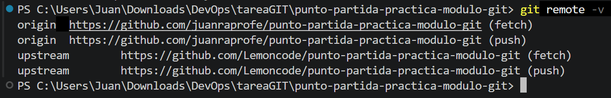
    <figcaption>Terminal de VSCode con git remote -v mostrando origin y upstream</figcaption>
</figure>

<!--  -->

6. Creamos la rama dev en local y la subimos a nuestro repositorio remoto.
    > `git switch -c dev`
    > `git push -u origin dev`

### Diario tarea 1
#### Fork
Un fork es una copia completa de un repositorio que se crea bajo tu propia cuenta en una plataforma como GitHub.

#### Upstream
`upstream` es simplemente un alias de un repositorio remoto, normalmente usado para referirse al repositorio original desde el que hiciste fork.

<figure>
  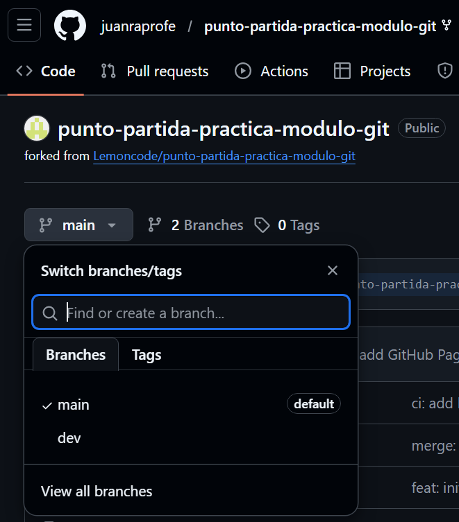
  <figcaption>GitHub con la rama dev visible en el desplegable de ramas</figcaption>
</figure>

<!--  -->


##  TASK 2 --> Feature branch A: añadir la Opción 5
Vamos a añadir una feature branch (rama nueva para añadir una característica nueva).
1. Desde la rama `dev` creamos la rama `feature/opcioin-5`
    > `git switch -c feature/opcion-5`
2. Abrimos el archivo src/app.tsx y añadimos la siguiente tarjeta al array OPTIONS:
    ```javascript
    {
    id: 5,
    title: "Opción 5",
    description: "Pull Request",
    message:
        "Una Pull Request es una propuesta formal para incorporar cambios de una rama a otra. Permite revisar el código antes de mergear y deja un historial claro de qué se hizo y por qué.",
    featureFlag: false,
    },
    ```
3. Ahora modificamos el campo `description` de la Opción 3 y lo cambiamos a:
    > `description: "Flujo de trabajo",`
4. Arrancamos la app para verificar en el navegador que aparece la Opción 5.
    > Atención: ver la nota aclaratoria en el diario de la tarea 2
5. Hacemos commit de las modificaciones con el mensaje: `feat: añadir Opción 5 y actualizar descripción de Opción 3`
    ```
    git add .
    git commit -m "feat: añadir Opción 5 y actualizar descripción de Opción 3"
    ```
6. Subimos la rama a nuestro repositorio en github.
    > `git push origin feature/opcion-5`

<figure>
  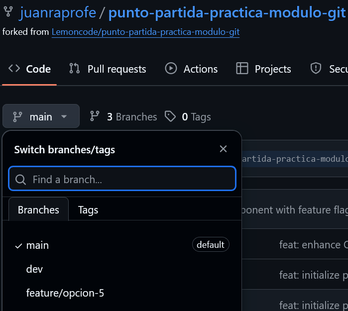
  <figcaption>Tras el <code>push</code> comprobamos que la rama <code>feature/opcion-5</code> se ha añadido al repositorio remoto</figcaption>
</figure>

### Diario tarea 2
#### Origen de la rama
La rama `feature/opcion-5` parte de la rama `dev` porque esa es la rama en la que nos encontrábamos al ejecutar el comando con el que la creamos:
> `git switch -c feature/opcion-5`

####  Nota aclaratoria
Tras añadir la opción 5 y arrancar la aplicación tan sólo están visibles las tarjetas 1, 2 y 5. 

<figure>
  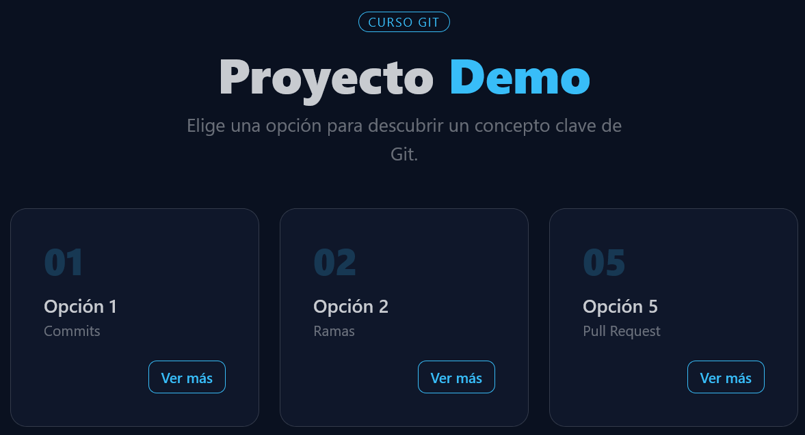
  <figcaption>App en ejecución. Sólo son visibles las tarjetas 1, 2 y 5</figcaption>
</figure>

Esto es debido a que el repositorio de partida del laboratorio no contiene algunos de los cambios realizados en la app durante la clase. Para ver la tarjeta 4 basta con descomentarla en el archivo `app.tsx` y para ver la tarjeta 3 tenemos que copiar el archivo `.env.example` en el archivo `.env` y resetear el servidor. La visibilidad de la tarjeta 3 está controlada por una `featureFlag` contenida en dicho archivo. 

<figure>
  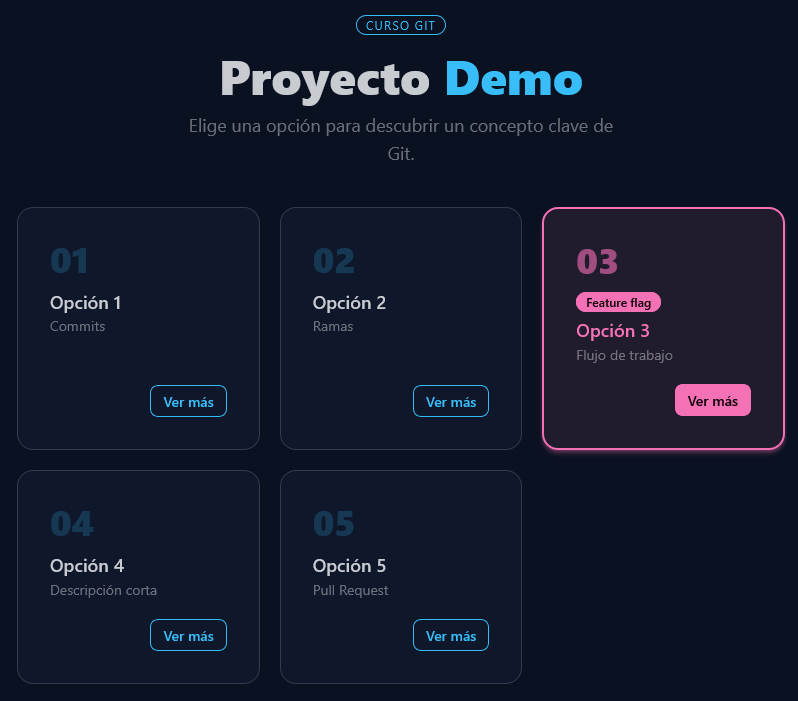
  <figcaption>Ya son visibles todas las tarjetas de la 1 a la 5</figcaption>
</figure>

Lo ideal habría sido realizar estas acciones en la rama `dev` antes de crear la `feature branch`. En vista de que no me he dado cuenta de esto hasta ahora y con el fin de reproducir los conflictos tal cual se describen en el laboratorio tendré que repetir esta operación en la siguiente `feature branch` o no podré ver en ella las tarjetas 3 y 4.


##  TASK 3 --> Feature branch B: añadir la Opción 6 y generar el conflicto
En esta tarea vamos a crear una nueva rama y a realizar una serie de modificaciones en la app incompatibles con las realizadas en la TASK 2, para poder generar así un conflicto.

Es importante que, para que aparezca el conflicto, el punto de partida de ambas ramas sea el mismo: cuando creemos la `feature branch B` la rama `dev` tiene que encontrarse en el mismo estado en que se encontraba cuando creamos la `feature branch A`; por eso el enunciado nos recuerda que debemos crear la nueva `feature branch` ANTES de fusionar (`merge`) dev con la rama de la TASK 2.

1. Regresamos a la rama `dev` y creamos la rama `feature/opcion-6` desde ahí.
    ``` 
    git switch dev
    git switch -c feature/opcion-6
    ```
2. Abrimos src/app.tsx y añadimos una nueva tarjeta al array OPTIONS:
    ```javascript
    {
    id: 6,
    title: "Opción 6",
    description: "gitignore",
    message:
        "El fichero .gitignore le dice a Git qué ficheros debe ignorar. Úsalo para excluir ficheros de entorno (.env), dependencias (node_modules) y cualquier cosa que no deba estar en el repositorio.",
    featureFlag: false,
    },
    ```
3. Ahora modificamos el campo `description` de la Opción 3 y lo cambiamos a:
    > `description: "Flujo profesional",`
4. Hacemos commit de las modificaciones con el mensaje: `feat: añadir Opción 6 y actualizar descripción de Opción 3`
    ```
    git add .
    git commit -m "feat: añadir Opción 6 y actualizar descripción de Opción 3"
    ```
5. Subimos la rama a nuestro repositorio en github.
    > `git push origin feature/opcion-6`

<figure>
  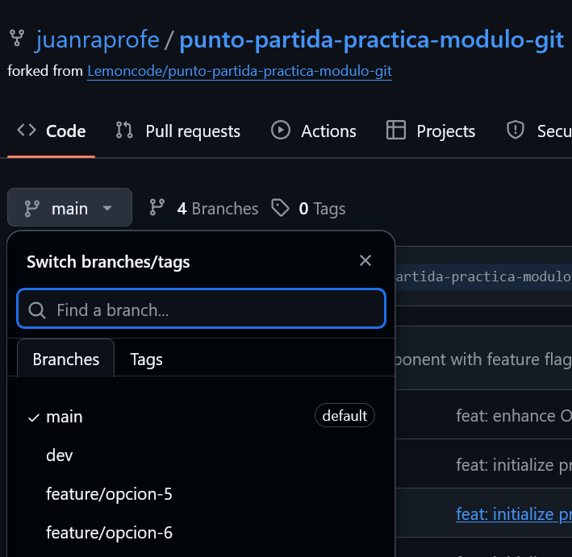
  <figcaption>Tras el <code>push</code> comprobamos que la rama <code>feature/opcion-6</code> se ha añadido al repositorio remoto</figcaption>
</figure>

### Diario tarea 3
#### Conflicto
Tenemos dos ramas `feature/opcion-5` y `feature/opcion-6` que parten ambas de la misma rama `dev`, y en ambas hemos realizado varios cambios como el añadir distintas tarjetas/opciones y modificar el valor del campo `description` de la Opción 3. Las tarjetas/opciones no se superponen, así que no plantean conflicto, son cambios compatibles entre sí, pero las distintas modificaciones del campo `description` sí son conflictivas. El valor de partida de ese campo es el mismo para ambas ramas, sin embargo el valor que hemos puesto ahora en cada una de ellas es diferente. Esto generará el conflicto en el momento de intentar mezclarlas (`merge`). 

<figure>
  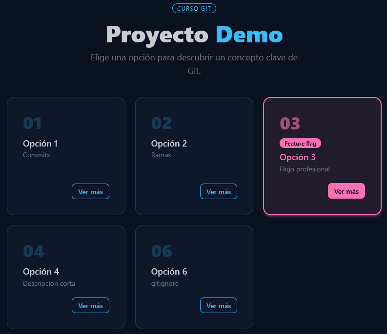
  <figcaption>Ahora tenemos una tarjeta 6 pero no la 5</figcaption>
</figure>


##  TASK 4 --> Pull Request 1: Feature A a dev
1. Abrimos una Pull Request en GitHub desde `feature/opcion-5` hacia `dev`.
2. Ponemos como título: feat: añadir Opción 5 y actualizar descripción de Opción 3
3. Antes de mergear, abrimos la pestaña Files changed y revisamos el diff.
4. Mergeamos la PR.
5. Actualizamos nuestra rama `dev` local con el comando `git pull origin dev`.

### Diario tarea 4
#### Files changed
Cuando revisamos la pestaña `Files changed` aparecen todas las modificaciones del repositorio (archivos cambiados, añadidos o eliminados) que la pull request va a introducir en la rama de destino al hacer `merge`. 

<figure>
  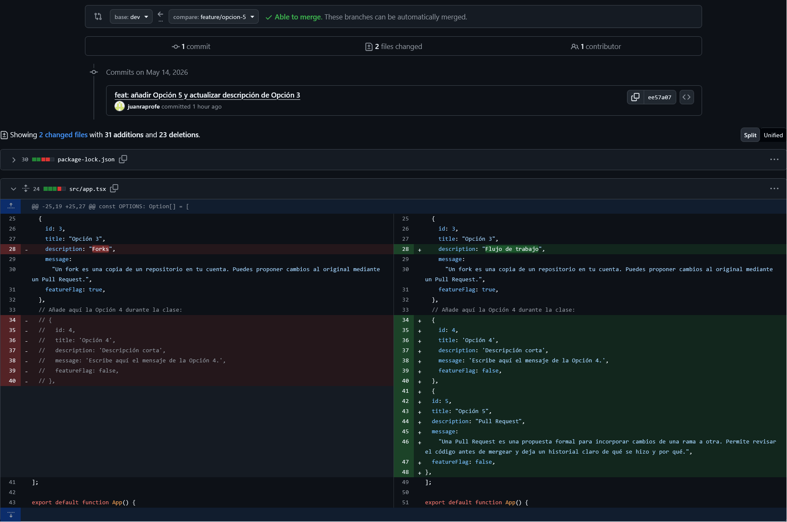
  <figcaption>PR de Feature A en GitHub con la pestaña Files changed abierta</figcaption>
</figure>

Esto nos permite comprobar que estamos fusionando los cambios que realmente queremos, y nos avisa, también, de si existen conflictos, lo que nos permite resolverlos manualmente en caso de que aparezcan. En nuestro caso podemos ver que esta PR no genera conflictos y se puede fusionar con la rama `dev` sin problemas.

<figure>
  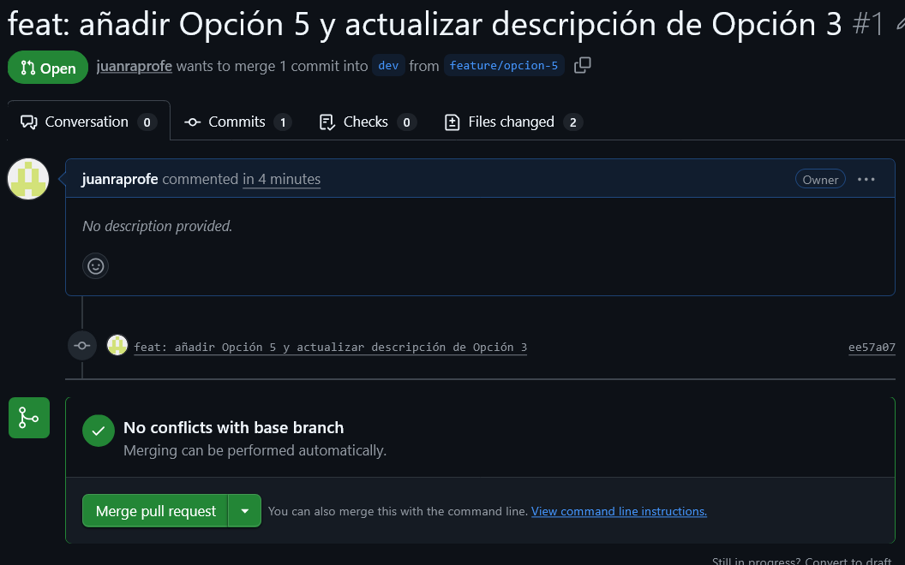
  <figcaption>PR de Feature A en GitHub con la pestaña Files changed abierta</figcaption>
</figure>

Una vez fusionadas las ramas con éxito Github nos informa de que la `feature branch` ya puede ser eliminada de manera segura.

<figure>
  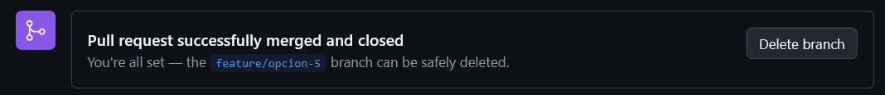
  <figcaption>Pull Request fusionada con éxito</figcaption>
</figure>


##  TASK 5 --> Pull Request 2: Feature B a dev, conflicto
1. Abrimos una Pull Request en GitHub desde `feature/opcion-6` hacia `dev`.
2. GitHub detecta un conflicto y no puede fusionar las ramas automáticamente.
<figure>
  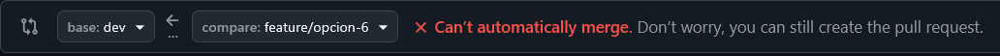
  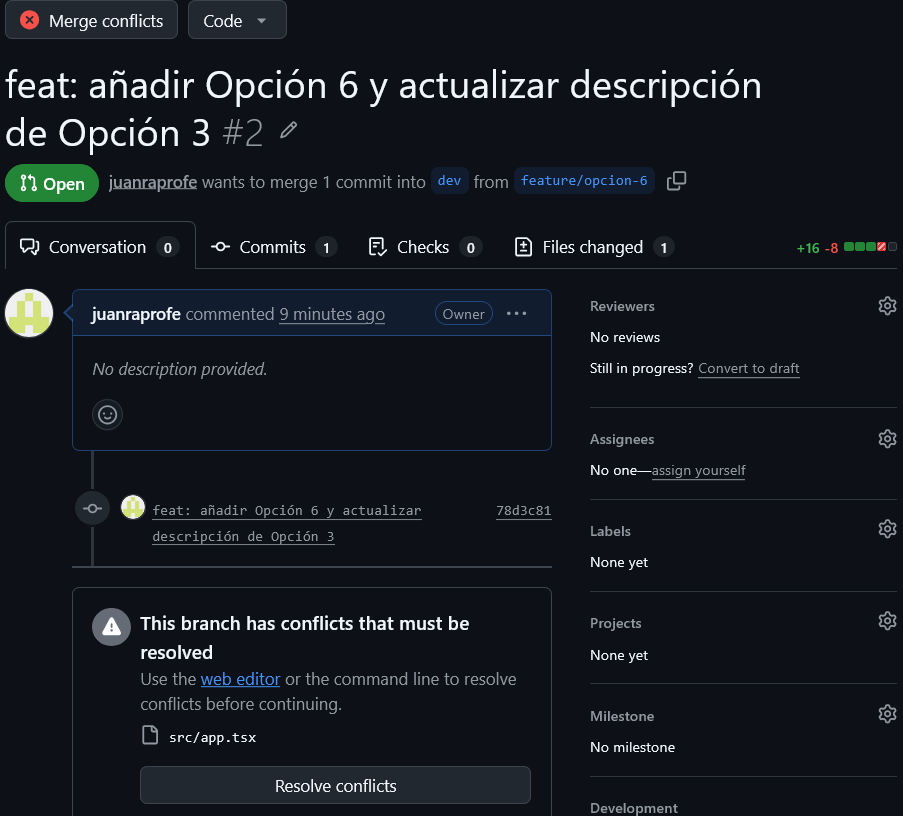
  <figcaption>Pull Request de la Feature B con conflicto</figcaption>
</figure>

3. Podemos resolver el conflicto directamente en Github, con el editor web, pero vamos a resolverlo en LOCAL siguiendo estos pasos:
    - Nos ponemos en la rama `feature/opcion-6`
        > `git switch feature/opcion-6`
    - Descargamos la rama `dev` remota
        > `git fetch origin dev`
    - Fusionamos ambas
        > `git merge origin/dev`
    - Abrimos src/app.tsx en VS Code y localizamos los marcadores de conflicto
    <figure>
    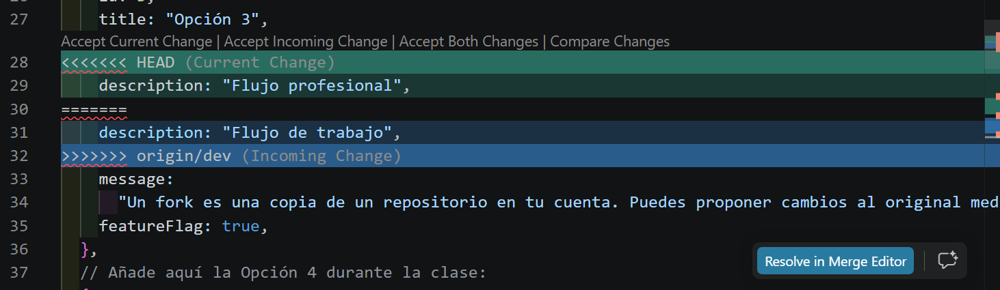
    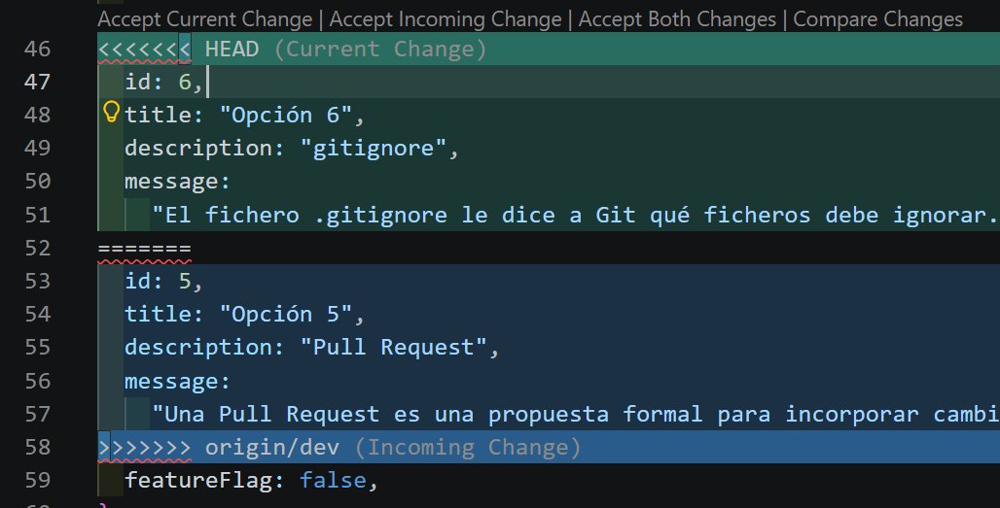
    <figcaption>Marcadores de conflicto en el archivo src/app.tsx</figcaption>
    </figure>

    - Tras decidir qué versión conservar, guardamos el fichero y arrancamos la app para verificar que se ven todas las opciones correctamente
    <figure>
    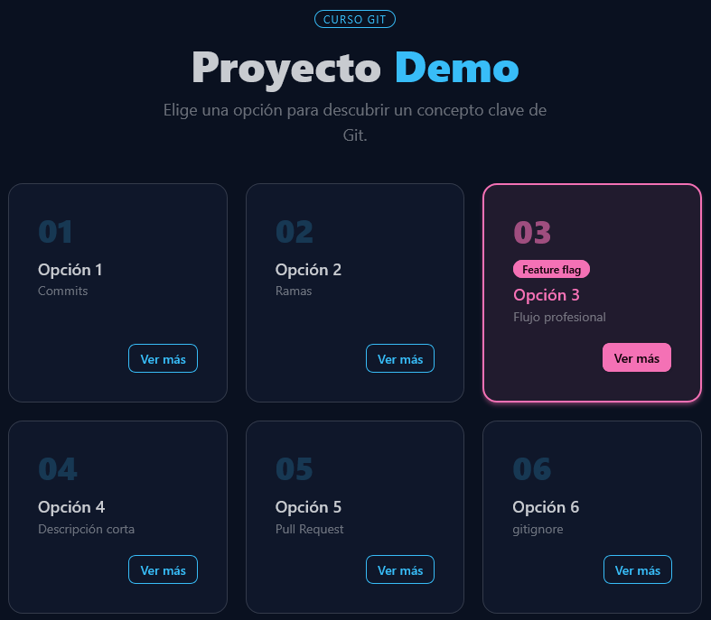
    <figcaption>La app con todas las opciones</figcaption>
    </figure>

    - Hacemos el commit de resolución y subimos la rama al repositorio remoto:
    ```
    git add .
    git commit -m "merge: resolución conflictos rama feature/opcion-6
    git push origin feature/opcion-6
    ```

    - Regresamos a la Pull Request de Github y comprobamos que el conflicto ha desaparecido y podemos fusionar las ramas.
    <figure>
    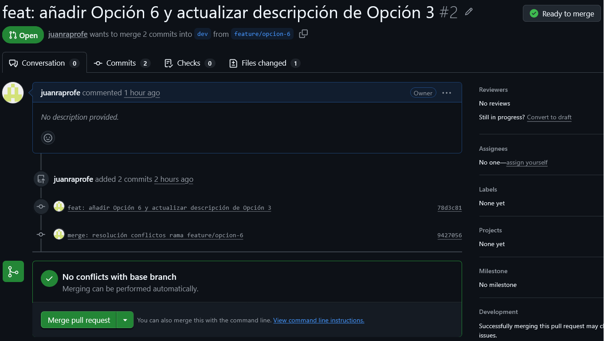
    <figcaption>La pull request ya no tiene conflictos</figcaption>
    </figure>

4. Por último actualizamos la rama `dev` local.
    > `git pull origin dev`.

### Diario tarea 5
#### Marcadores de conflicto (<<<<<<<, =======, >>>>>>>)
```
<<<<<<< HEAD (Current Change)
Código de la rama donde estamos ubicados actualmente.
=======
Código de la rama externa que estamos intentando fusionar.
>>>>>>> nombre-de-la-otra-rama (Incoming Change)
```
En nuestro caso nos encontramos en la rama `feature/opcion-6` y estamos 'importando' código de la rama `origin/dev`


##  TASK 6 --> Limpieza y cierre del diario
1. Eliminamos las `feature branches`tanto en local como en remoto
2. Incluimos en nuestro proyecto el archivo `Diario.md` y la carpeta con todas las capturas.
3. Hacemos `commit`y `push`

Lo más difícil de esta práctica ha sido quizás asimilar y entender bien los flujos de trabajo en Git y comprender la diferencia real entre un fetch y un pull. Me ha gustado la forma visual en que Git, mediante los marcadores, estructura los conflictos.
<figure>
  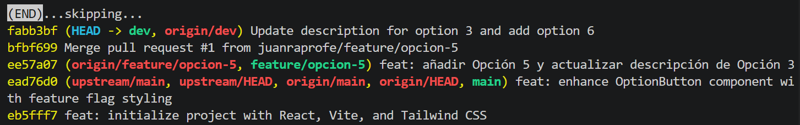
  <figcaption>commits</figcaption>
</figure>

